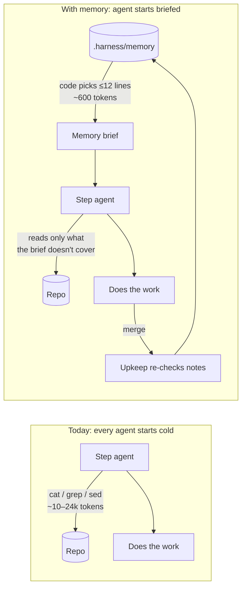
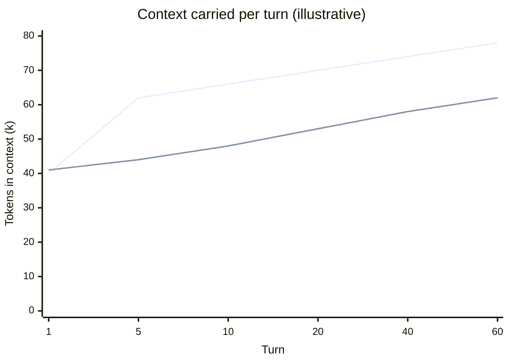
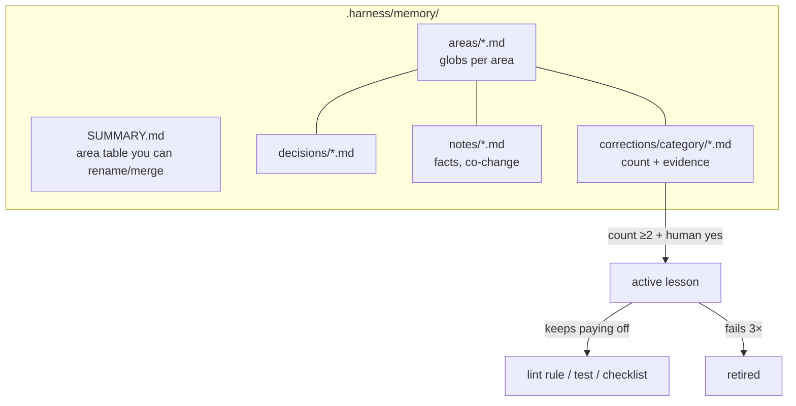
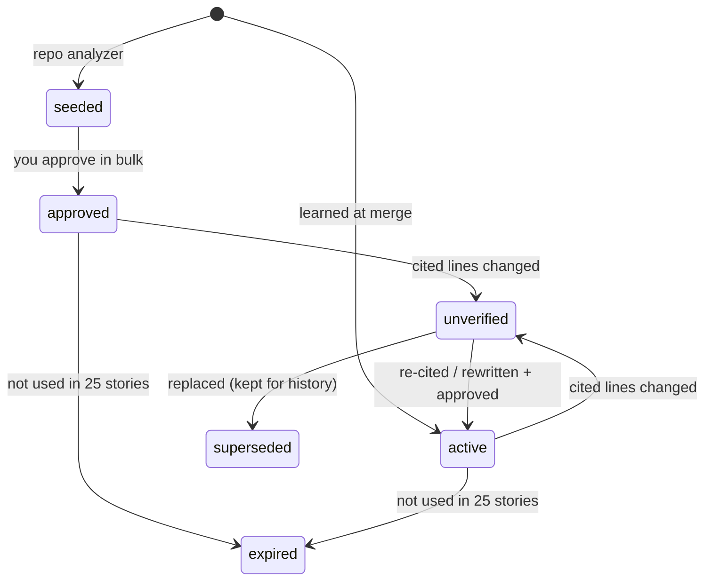
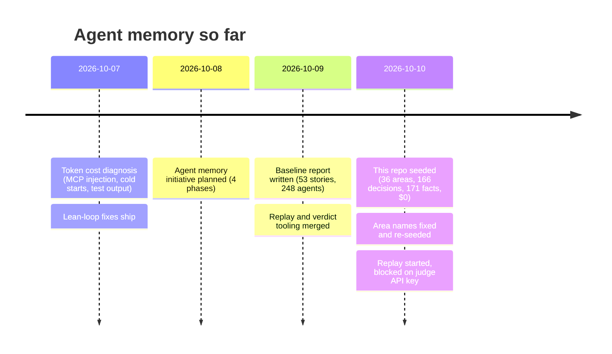
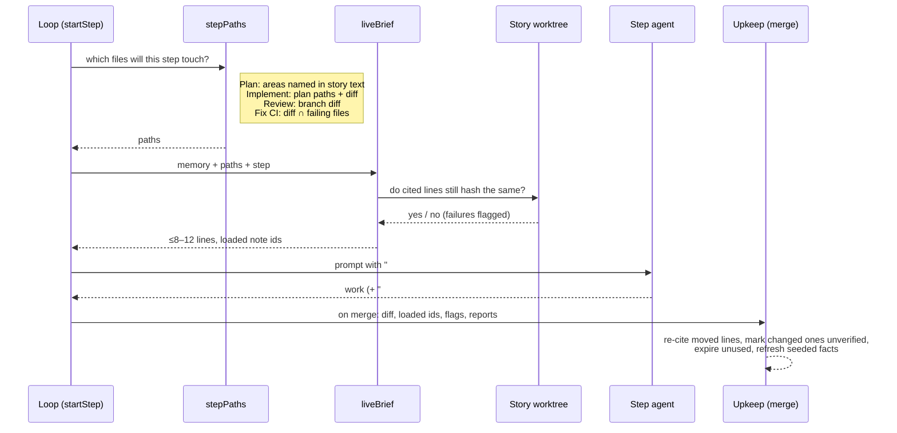
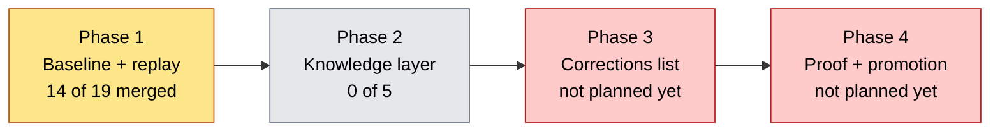

# Agent memory: what it is and why we're building it

This is the plain-English version of the agent memory plan, written for people.
The working plan lives in `.harness/initiatives/agent-memory/`. That folder is
git-ignored, so it exists only on the machine that runs the loop. This page is
the copy in git. Update it whenever a decision changes.

*Last updated: 2026-10-10.*

---

## In one minute

Every step agent (Plan, Implement, Review, Fix CI) starts with an empty context.
Before it changes anything, it spends thousands of tokens running `cat`, `grep`
and `sed` to work out what the code does. The next agent on the same files does
it all again. Whatever Review found on one story is gone once that story merges.

Agent memory stores what the loop has learned in plain files in each repo. When
a step starts, plugin code (not a model) picks the 8 to 12 facts that match the
files the step will touch and puts them at the top of the prompt. The agent
reads a short brief instead of exploring.

It has to earn its place. A no-memory holdout runs alongside it, and memory
switches itself off in any repo where it doesn't measurably help.

---

## Why it saves money

### 1. Exploration is the biggest cost we can avoid

From the baseline (`baseline.md`, 248 agents over 53 merged stories, up to
2026-10-09):

| Step | Agents | Exploration output per agent (chars) | ≈ tokens per agent* |
|---|---:|---:|---:|
| Plan | 56 | ~55,700 | ~24,000 |
| Implement | 118 | ~24,600 | ~10,500 |
| Review | 62 | ~45,200 | ~19,000 |

\* Characters ÷ 4, multiplied by 1.71, the measured ratio of billed tokens to
that estimate (n = 10, so treat it as rough). The counts cover reads, searches
and shell output up to the agent's first edit.

A memory brief has a hard cap: 8 to 12 lines of at most 200 characters, about
600 tokens at most.

### 2. Context is paid for again on every turn

Whatever an agent reads stays in its context and is sent again with every later
turn. Most of that is billed as cache reads, which are cheaper but not free.
When we measured on 2026-10-07, 97% of all harness tokens were cache reads.
Reading 20k tokens on turn 3 of a 60-turn session means paying for them about
57 more times.

### 3. Fewer review rounds means fewer agents

Each failed Review round starts a new Implement agent and a new Review agent,
and both start cold. When a lesson Review already taught stops the same mistake
from coming back, those two agents never run. Phase 3 targets this, and only if
the data supports it (see below).

### 4. Looking things up costs nothing

Agents never search memory. The plugin matches file paths to areas, checks
citations by reading local files, and ranks notes. None of that needs a model.
A model runs in only two places: once per repo when sorting corrections into
categories (capped at $3) and at merge to rewrite stale notes (capped at $1).

---

## 4W1H

### What

Two layers of plain Markdown files in each repo, under `.harness/memory/`:

- **Knowledge**: *areas* (named parts of the code, each with file globs),
  *decisions* (taken from locked `architecture.md`, CONTEXT.md and README),
  and *notes* (facts, and which files change together). Each note cites
  `file:lines#hash`.
- **Corrections**: mistakes the loop has seen before, sorted into fixed
  categories (`testing · types · error-handling · conventions · boundaries ·
  security · ci-env · performance · scope`). If a mistake comes up again, its
  count goes up; it is never added twice. At ≥2 occurrences plus your yes, it
  becomes active. If it keeps paying off, it is promoted to a lint rule, test
  or checklist line and removed from memory.

**Each note's lifecycle:**

Only `active` notes and `seeded` notes you have approved can go into a brief.
`unverified`, `superseded`, `expired` and (for now) corrections never do.

### Why

- **Cost.** See above. Cold starts and exploration made up most of the harness
  spend we measured on 2026-10-07.
- **Repeated mistakes.** Review findings, CI failures and Plan pushback were
  lost at merge, so the next agent could make the same mistake.
- **Honesty about risk.** Research shows memory can make agents *worse*, and
  that shaped every rule here:
  - *ETH Zurich, "Evaluating AGENTS.md" (ICLR 2026)*: repo overviews written
    by a model cut task success ~3% and raised cost 20%+. Agents follow
    instructions they find in context and explore more. **→ No repo overview,
    facts only, no instructions, hard cap.**
  - *"How Memory Management Impacts LLM Agents" (ACL 2026)*: agents copy what
    they retrieve, so bad memories spread. Adding selectively and deleting
    beat letting memory grow by ~10%. **→ ≥2 occurrences to activate, retire
    on failure, expiry.**
  - *GitHub Copilot Memory*: memories cite code, are checked against the
    current branch when used, and expire when unused. **→ Use-time citation
    check, 25-story expiry.**

### Where

| Thing | Location |
|---|---|
| Memory files | `<repo>/.harness/memory/` (each repo keeps its own; nothing leaves it) |
| Memory code | `server/memory.ts`, `server/repo-analyzer.ts`, `server/repo-facts.ts`, `server/corrections.ts`, `server/correction-*.ts` |
| Seeding | `scripts/seed-memory.mjs` |
| Replay | `server/memory-replay.ts`, `server/replay*.ts`, started from ⌘K |
| Measurement | this folder: `report.mjs` → `baseline.md`, `verdict.mjs` → `verdict.md` |
| Full plan | `.harness/initiatives/agent-memory/` (local only) |

Work-repo memory (e.g. `lifeway-discipleship`) stays in that repo's `.harness`.
Its numbers are never committed here.

### When

### How

The prompt tells the agent to trust the code over a note and to report any
note that turns out to be wrong.

---

## Decision log (ADR-style)

| # | Decision | Why | Rejected |
|---|---|---|---|
| 1 | Plain files under `.harness/memory/`, owned by the plugin | Easy to read, diff and fix by hand; stays in the repo | Obsidian vault, database, hosted memory (Mem0/Graphiti) |
| 2 | Code does the lookup; agents never search | Free, predictable, and keeps each step's context fresh | Search tool for agents, vector similarity |
| 3 | Look notes up by file path, not by similarity | Steps already know their files; paths are exact | Embeddings |
| 4 | Briefs hold facts and file pointers only, with a hard cap (Plan 8, Implement 12, Review 12, Fix CI 8 lines) | ETH Zurich result: instructions and overviews hurt | Repo overview, "run X / check Y" lines |
| 5 | Areas are module slices: CONTEXT.md terms, then files that change together, then folders | Folders are too coarse here (3 flat folders), single files too fine | Folder-only, file-only |
| 6 | Seeded notes rank below learned ones and need one bulk approval | Analyzer output is a guess until a human looks at it | Trusting seeded notes automatically |
| 7 | Citations are checked when a note is used; a failing note is dropped, not partly shown | Stale memory is worse than none | Trusting `verified_at` |
| 8 | Merge upkeep: code changes apply automatically; model rewrites wait for approval | Mechanical fixes are safe; model text could be wrong | Auto-applying model rewrites |
| 9 | Expire after 25 merged stories, not days | The loop's throughput comes in bursts | Copilot-style 28 days |
| 10 | A correction needs ≥2 occurrences plus a human yes; it retires after 3 failures | Bad memories spread (ACL 2026) | Activating on first sight |
| 11 | Replay past Reviews in 3 arms (none / facts / facts+corrections) before building more | Measure task success, not just tokens | Building first, measuring later |
| 12 | Replay memory is rebuilt as of each story's base commit | Stops the replay from seeing the answer | Using current memory |
| 13 | Memory is off by default per repo and needs an approved `SUMMARY.md` to turn on | Opting in is safer, and gives the holdout a switch | On by default |
| 14 | Phase 2 builds facts only until the replay verdict lands | No evidence for corrections yet (n = 0) | Building corrections on a guess |

**Pass bar.** Memory stays on in a repo only if all four hold against the
holdout: exploration tokens drop; review rounds drop ≥30% on areas with active
lessons; zero regressions with tokens per story flat or lower; task success no
worse.

---

## Where we are

**Built and merged:** exploration counted on every telemetry row (including
shell reads), each story's outcome kept in its story file, the memory file
format, the baseline report, the repo analyzer (facts and corrections), the
three-arm replay runner, the verdict script, and the merge time stamped on
story files.

**Current verdict:** *no replay data yet* (`verdict.md`). The provisional
call:

- Phase 2: build facts only.
- Phase 3: wait.
- Phase 4: keep corrections-to-checks. The baseline repeat rate is 20%
  (3 of 15 findings, by keyword guess), under the 25% line.

**Blocker (needs a human):** S12, the real replay. It started (20 rounds × 3
arms, $50 cap, 9 rows written), but the judge has no Anthropic API key, so
every result is `outcome: null`. To unblock: add the `anthropic-api-key`
Keychain item or set `ANTHROPIC_API_KEY` for the Paseo daemon, reload the
plugin, rerun the replay from ⌘K, label `new-findings.md` and the dedupe
sample, then rerun `verdict.mjs`.

---

## Not yet started

The full picture, including work that may never ship if the data says no.

### Phase 1 leftovers

| Story | What | Status |
|---|---|---|
| S12 | Run the replay here and in `lifeway-discipleship`, rewrite the verdict | blocked (API key) |
| S16 | Date baseline stories by `merged_at` | implementing |
| S17 | Backfill `merged_at` on stories merged before S15 | todo |
| S18 | Cut agent transcripts at the baseline cutoff | PR open |
| S19 | Compare s11 loader cutoffs as times, not strings | todo |

### Phase 2: Knowledge layer (planned, 0 of 5)

| Story | What |
|---|---|
| S14 | `liveBrief`: only approved notes whose citations still hold, capped per step |
| S15 | `stepPaths` / `planTerms`: which files each step's brief covers |
| S16 | Add `## Memory brief` to live prompts; record loaded notes; on/off setting per repo |
| S17 | Merge upkeep: re-cite, mark unverified, expire, refresh seeded facts |
| S18 | A cheap model rewrites unverified notes (unapproved until you approve them) |

Human tasks outside the loop: approve the seeded notes in bulk (none approved
yet), and set the API key and re-seed so corrections exist before Phase 3.

Open decisions: note eligibility (d1), paths per step (d3), what happens when
a citation fails (d4), recording loaded notes (d5), the on switch (d8),
defaults (d9).

### Phase 3: Corrections list (gated on S12)

- **Capture** mistakes mechanically from Review findings, failed CI checks,
  review rounds, blocked reasons and Plan corrections.
- **Dedupe** at merge within the same category and area: count up, or add a
  new candidate.
- **Activate** at ≥2 plus your yes/no on the board.
- **Inject** active corrections into the brief, labelled with category and
  count.
- **Score**: if the finding comes back while its lesson was loaded, that
  counts as a failure; 3 failures retire it.

Open: canonical phrase format, where the yes/no lives in the UI, cap on
candidates per area.

### Phase 4: Proof and promotion (gated on S12)

- **Holdout**: about 1 in 4 stories runs without memory; a dashboard card
  compares task success first, then tokens, rounds and CI fixes.
- **Auto-off** in any repo that misses the pass bar.
- **Use tracking**: a loaded note whose files the agent reads again anyway
  isn't saving anything, so it gets flagged.
- **Promotion**: corrections that keep paying off become lint rules, tests,
  types or Review checklist lines, and leave memory.

Open: holdout ratio and how it's chosen, minimum sample before auto-off,
whether promotions become stories automatically.

### Ideas considered and parked

- **How-it-works prose** in notes: parked because the evidence says prose can
  lower success. To be revisited for the worst-explored areas once Phase 4
  shows where briefs fail.
- **Memory graph viewer page**: out for now.
- **Vector stores / hosted memory (Mem0, Graphiti)**: the upgrade path if notes
  ever outgrow tags and paths.
- **Shared memory across repos or users**: out of scope.

---

## Glossary

- **Brief**: the `## Memory brief` section the plugin adds to a step's prompt.
- **Area**: a named slice of the code with file globs. Rename or merge areas
  by editing `SUMMARY.md`.
- **Seeded**: written by the repo analyzer. Unused until you approve it.
- **Citation**: `path:from-to#hash`, the first 8 hex characters of a sha1
  over the cited lines.
- **Holdout**: stories that run without memory, used for comparison.
- **Arm**: one replay condition: `none`, `facts`, or `facts+corrections`.
